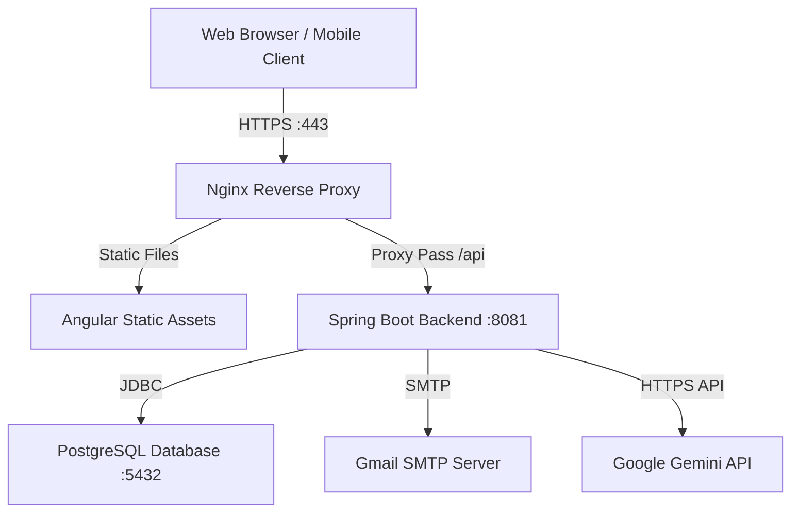

# Secure Deployment Plan & Guide - Ubuntu Server

This guide outlines the production deployment plan for the Parshuram Kund Mela 2027 application (Spring Boot Backend + Angular Frontend + PostgreSQL Database) on an Ubuntu Server environment.

---

## 1. System Architecture



---

## 2. Prerequisites & Server Setup

Log in to your Ubuntu Server and update system packages:
```bash
sudo apt update && sudo apt upgrade -y
```

### Install Required Software
Install **Java 17 (OpenJDK)**, **Node.js 20+**, **PostgreSQL**, **Nginx**, and **Git**:
```bash
# Install OpenJDK 17
sudo apt install openjdk-17-jdk openjdk-17-jre -y

# Install Node.js (via NodeSource LTS)
curl -fsSL https://deb.nodesource.com/setup_20.x | sudo -E bash -
sudo apt install -y nodejs

# Install PostgreSQL, Nginx, and Git
sudo apt install postgresql postgresql-contrib nginx git -y
```

Verify installations:
```bash
java -version
node -v
npm -v
psql --version
nginx -v
```

---

## 3. Database Configurations

1. Access the PostgreSQL command line under the `postgres` user:
   ```bash
   sudo -i -u postgres psql
   ```

2. Create the database, user, and grant privileges:
   ```sql
   CREATE DATABASE parshuramkund;
   CREATE USER mela_admin WITH PASSWORD 'SecureMelaPassword123';
   GRANT ALL PRIVILEGES ON DATABASE parshuramkund TO mela_admin;
   \q
   ```

3. Database migrations will execute automatically. On the first run of the backend, Flyway will apply all schema scripts in order (`V1` through `V10`).

---

## 4. Build and Package Application

It is recommended to package the applications locally and copy them via SCP/SFTP to save server resources.

### A. Backend Packaging (Spring Boot)
In the `ParshuramKund Backend` directory:
```bash
# Package backend fat jar
./mvnw clean package -DskipTests
```
The executable jar `ParshuramKund-0.0.1-SNAPSHOT.jar` is generated in `target/`. Copy this jar to `/var/www/mela/backend/` on the server.

### B. Frontend Packaging (Angular)
In the `ParshuramKund` directory:
```bash
# Install dependencies
npm install

# Build static production assets
npm run build --configuration=production
```
The static files compile inside the `dist/ParshuramKund/browser/` directory. Copy this entire folder to `/var/www/mela/frontend/` on the server.

---

## 5. Backend Service Deployment (Systemd)

To run the Spring Boot jar as a background service that auto-starts on boot:

1. Create a service config file:
   ```bash
   sudo nano /etc/systemd/system/mela-backend.service
   ```

2. Paste the configuration below (adapt environment secrets as needed):
   ```ini
   [Unit]
   Description=Parshuram Kund Backend Service
   After=syslog.target network.target postgresql.service

   [Service]
   User=www-data
   Type=simple
   WorkingDirectory=/var/www/mela/backend
   ExecStart=/usr/bin/java -jar ParshuramKund-0.0.1-SNAPSHOT.jar
   
   # Production Environmental Configurations
   Environment=SPRING_DATASOURCE_URL=jdbc:postgresql://localhost:5432/parshuramkund
   Environment=SPRING_DATASOURCE_USERNAME=mela_admin
   Environment=SPRING_DATASOURCE_PASSWORD=SecureMelaPassword123
   Environment=GEMINI_API_KEY=your_gemini_api_key_here
   
   # SMTP Credentials
   Environment=SPRING_MAIL_USERNAME=parshuramkundlohit@gmail.com
   Environment=SPRING_MAIL_PASSWORD=iwrx yczt errt lmgu
   
   SuccessExitStatus=143
   Restart=on-failure
   RestartSec=10

   [Install]
   WantedBy=multi-user.target
   ```

3. Configure folder permissions:
   ```bash
   sudo mkdir -p /var/www/mela/backend/aadhar-photos
   sudo chown -R www-data:www-data /var/www/mela
   ```

4. Enable and start the backend service:
   ```bash
   sudo systemctl daemon-reload
   sudo systemctl enable mela-backend
   sudo systemctl start mela-backend
   ```

---

## 6. Nginx Reverse Proxy Setup

Nginx will serve the static frontend assets directly and proxy `/api/` calls to the Spring Boot backend service on port `8081`.

1. Create Nginx site configuration:
   ```bash
   sudo nano /etc/nginx/sites-available/parshuramkund
   ```

2. Add virtual host configuration (replace `yourdomain.com` with your domain/public IP):
   ```nginx
   server {
       listen 80;
       server_name yourdomain.com www.yourdomain.com;

       root /var/www/mela/frontend;
       index index.html;

       # Serve static Angular files
       location / {
           try_files $uri $uri/ /index.html;
       }

       # Proxy API requests to Spring Boot
       location /api/ {
           proxy_pass http://localhost:8081/api/;
           proxy_http_version 1.1;
           proxy_set_header Upgrade $http_upgrade;
           proxy_set_header Connection 'upgrade';
           proxy_set_header Host $host;
           proxy_cache_bypass $http_upgrade;
           proxy_set_header X-Real-IP $remote_addr;
           proxy_set_header X-Forwarded-For $proxy_add_x_forwarded_for;
           proxy_set_header X-Forwarded-Proto $scheme;
           
           # Allow up to 10MB file uploads (Aadhaar uploads)
           client_max_body_size 10M;
       }

       error_page 404 /index.html;
   }
   ```

3. Enable the site and restart Nginx:
   ```bash
   sudo ln -s /etc/nginx/sites-available/parshuramkund /etc/nginx/sites-enabled/
   sudo rm /etc/nginx/sites-enabled/default
   sudo nginx -t
   sudo systemctl restart nginx
   ```

---

## 7. Let's Encrypt SSL (HTTPS Encryption)

To protect sensitive Aadhaar numbers and photo uploads with transit-level HTTPS encryption:

1. Install Certbot:
   ```bash
   sudo apt install certbot python3-certbot-nginx -y
   ```

2. Obtain and apply the certificate:
   ```bash
   sudo certbot --nginx -d yourdomain.com -d www.yourdomain.com
   ```
   *Follow the interactive prompt to enforce redirection of all traffic to HTTPS.*

---

## 8. Backup & Maintenance Recommendations

> [!WARNING]
> Regularly back up the PostgreSQL database and Aadhaar upload files.

- **PostgreSQL Database Backup**:
  ```bash
  pg_dump -U mela_admin parshuramkund > /var/backups/mela_db_$(date +%F).sql
  ```
- **Aadhaar Uploads Backup**:
  ```bash
  tar -czf /var/backups/aadhar_photos_$(date +%F).tar.gz /var/www/mela/backend/aadhar-photos/
  ```
